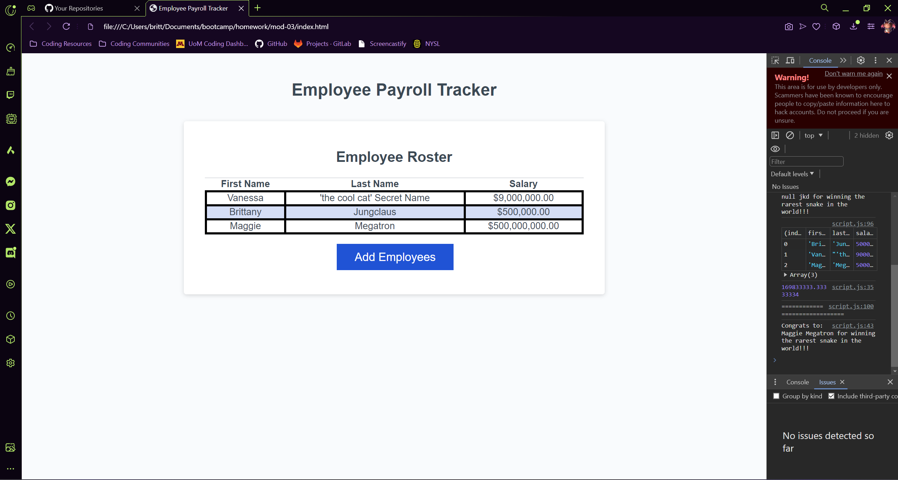

# 03 JavaScript: Employee Payroll Tracker

## The Challenge

This week's Challenge requires you to modify starter code to create an application that enables a payroll manager to view and manage employee payroll data. This app will run in the browser and will feature dynamically updated HTML and CSS powered by JavaScript code that you write. It will have a clean and polished, responsive user interface that adapts to multiple screen sizes.

## What I Completed

```md
I have allowed the Employee button to be functional with the User being able to add a new first and last name, and their salary. 
```

## The Mock-Up

The following images show the web application's appearance and functionality:




## The Deployments

The Repo: ()

The Deployment: ()